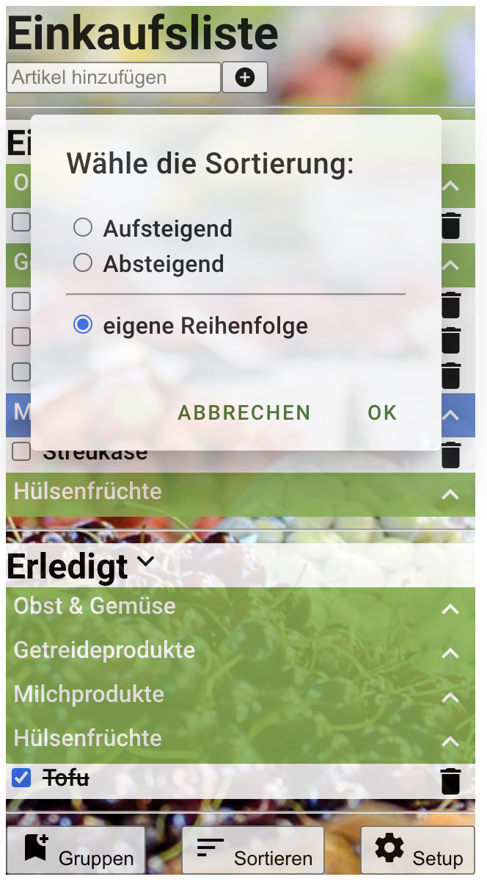

# React

Hinweise zur Bearbeitung:

- Achte auf einen sauberen Quellcode, insbesondere Einrückungen sind wichtig!
- Jede Komponente sollte in einer eigenen .js Datei deklariert werde. Diese werden dann mit script tags importiert
- Beim erstellen von Methoden in einer Komponente, nutze `name = (parameter) => {code}` statt der üblichen Schreibweise.
  Diese Schreibweise ermöglicht es mit `this` immer die Komponente anzusprechen in der die Methode steht, statt die in
  der sie tatsächlich ausgeführt wird. Das ist wichtig wenn wir Funktionen als props an andere Komponenten geben.

---

## Lektion 6

Erstelle eine eigene Komponente namens `SortierDialog`.

### Konstruktor

Im Konstruktor sollte der state der Komponente gesetzt werden. Dieser sollte aus 2 Attributen bestehen:

- showDialog, welches der `visible` property entspricht.
- sortierung, welches der aktuellen Sortierung entspricht(der Startwert entspricht also der `sortierung` property)

### Sonstige Funktionen

- handleChange:

  Erhält als Parameter ein event(die Variable für solche Events wird of einfach `e` genannt). Die Methode ist der
  handler für Veränderungen in der Auswahl der Sortierungen und soll die `sortierung` im `state` updaten. Die `value`
  des angeklickten Knopfes ist im Event gespeichert und kann über `e.target.value` ausgelesen werden(wobei `e` der Name
  der Event Variable ist)

- dialogHandler:

  Erhält als Parameter einen boolean der `true` ist wenn die Aktion bestätigt wurde und tatsächlich sortiert werden soll
  und `false` wenn abgebrochen wurde und nicht sortiert werden soll. Diese Methode schliesst den Dialog indem sie die
  Methode aufruft die als `onDialogClose` property mitgegeben wurde, welche zwei Parameter erhält:
  - die ausgewählte Sortierung die im `state` der Komponente gespeichert ist
  - den boolean den die dialogHandler Funktion als Parameter erhalten hat, der festlegt ob die Liste tatsächlich neu
    sortiert werden soll.

  Für die genaue Implementation der `onDialogClose` Funktion siehe "Aufruf in `ShoppingTag.js`"

---

### render() Methode:

Die Komponente solle aus 3 geschachtelten, alles umschließenden `
` tags mit folgenden `className` Attributen
bestehen:

- Äußerstes `
` : `mdc-dialog mdc-dialog--open` wenn die visible property des GruppenDialogs `true` ist, und
  nur `mdc-dialog` sonst(über die mdc-dialog--open Klasse wird die Sichtbarkeit des Dialogs gesteuert)
- Mittleres `
` : `mdc-dialog__container`
- Innerstes `
` : `mdc-dialog__surface`

Schreibe die Überschrift für das Dialog Fenster innerhalb der divs in ein `<h2>` tag mit `className` `mdc-dialog__title`
.

Nun folgt ein `
` tag mit `className` `mdc-dialog__content` in welches der Hauptbestandteil des Dialogs kommt, also
alles was bei HTML im header und main Bereich wäre.

Erstelle in diesem Bereich also eine ungeordnete Liste mit `className` `mdc-deprecated-list` und als `onChange`
Attribut, lege die oben beschriebene Methode `handleChange` fest.

Erstelle nun so viele Listenelemente wie du Möglichkeiten zur Sortierung hast. Jedes dieser Listenelemente sollte
mindestens ein `input` tag enthalten mit folgenden Attributen:

- `type` : `radio`
- `id` : einer einzigartigen id
- `name` : einem Namen der für alle input Elemente gleich ist
- `value` : der Sortierung entsprechend(z.B. `"aufsteigend"`/`"absteigend"`). Hierbei ist es wichtig, dass dieser Wert
  genau dem Wert entspricht, der später der `Sortieren` Methode der App mitgegeben wird. Wenn du unsicher bist, schau
  dir die Sortieren Methode in `App.js` nochmal an.
- `defaultChecked` : true wenn die Sortierung die momentan im state der Komponente gespeichert ist der Sortierung für
  die dieser Knopf stehen soll entspricht und sonst `false`.

Des weiteren sollte in dem Listenelement stehen, um welche Sortierung es sich handelt, am besten direkt nach dem `input`
Tag. Das genaue Format des Listenelements bleibt dir überlassen. Hinweis : nutze ein `label` Tag mit `htmlFor` Attribut
um dafür zu sorgen, dass man nur auf den Text klicken muss anstatt genau auf den Knopf. Ausserdem kannst du zwischen den
Listenelementen an angemessenen Stellen Trennzeichen einbauen wie z.B. ein `hr` tag.

Nun folgt ein `
` tag mit `className` `mdc-dialog__actions` in welches die abschließenden Funktionen kommen, also
alles was bei HTML im footer Bereich wäre(also ist das `mdc-dialog__content` hier vorbei).

In diesem befinden sich zwei `button` tags, jeweils mit `type` `button` und `className` `mdc-dialog__button`. Ausserdem
sollten beide im `onClick` Attribut eine Pfeilfunktion erhalten, die die oben beschriebene `dialogHandler` Funktion
aufruft, beim ersten Button mit Parameter `false`(abbrechen) und beim zweiten mit `true`(akzeptieren).

Im `button` tag, sollten sich folgende tags befinden:

- ein `div` mit `className` `mdc-button__ripple`, welches für einen visuellen Effekt sorgt wenn man auf den Knopf drückt
  oder seine Maus darauf bewegt
- Ein `span` mit `className` `mdc-button__label`, welches widerum die Knopfaufschrift enthält

- Für genauere Erklärung,
  siehe [Material.io Dokumentation zu Dialogen](https://material.io/components/dialogs/web#using-dialogs)

### Aufruf in `ShoppingTag.js`

Füge dem `state` von `ShoppingTag` folgende Variablen hinzu:

- `sortierung` : Wo die aktuelle Sortierung gespeichert wird. Sollte standardmäßig `"Eigene"` sein.
- `showSortierDialog` : Welche speichert ob der Sortier-Dialog gerade angezeigt wird oder nicht. Sollte
  standardmäßig `false` sein.

Erstelle eine Methode `closeSortierDialog`. Diese Methode soll aufgerufen werden wenn der Dialog sich schliesst. Sie
erhält zwei Parameter:

- `reihenfolge` : Die reihenfolge die im SortierDialog ausgewählt wurde
- `sortieren` : Einen boolean, der `true` ist wenn der Dialog bestätigt wurde und die Liste tatsächlich sortiert werden
  soll, und `false` wenn abgebrochen wurde und nicht sortiert werden soll.

In der Methode, rufe die `sortieren` Methoder der `App` auf, wenn der `sortieren` Parameter `true` ist. Setze dann(
unabhängig vom `sortieren` Parameter) die `showSortierDialog` Variable im `state` auf `false` um den Dialog zu
schliessen.

Füge nun in der `render` Methode unmittelbar nach dem Ende des `footer` das `SortierDialog` tag mit folgenden Attributen
ein:

- `visible` : entspricht der `showSortierDialog` Variable im `state`
- `sortierung` : entspricht der `sortierung` Variable im `state`
- `onDialogClose` : die `closeSortierDialog` Funktion

Nun füge dem Knopf der den Dialog öffnen soll noch eine Pfeilfunktion als `onClick` Attribut hinzu, die
die `showSortierDialog` Variable im `state` auf `true` setzt.

---

## Endergebnis

An dem Erscheinungsbild deiner App sollte sich nichts geändert haben. Wenn du nun auf den Knopf drückst der den Sortier Dialog öffnen soll, sollte es ungefähr so aussehen:

>

Hier kannst du nun verschiedene Sortierungen auswählen die wenn du auf den Bestätigen Knopf drückst auf die Liste angewendet werden und der Dialog schliesst sich wieder.

